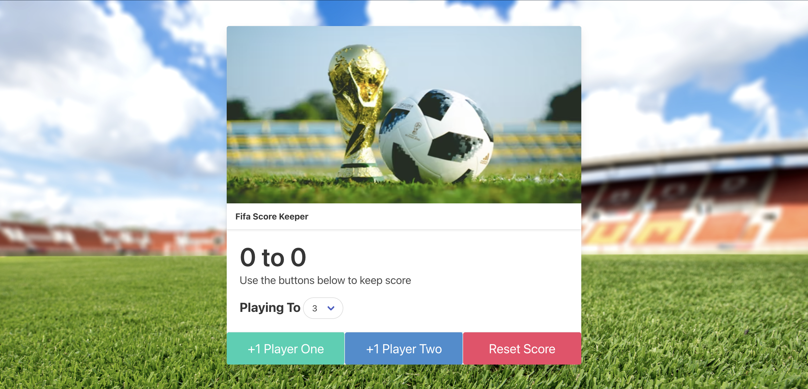
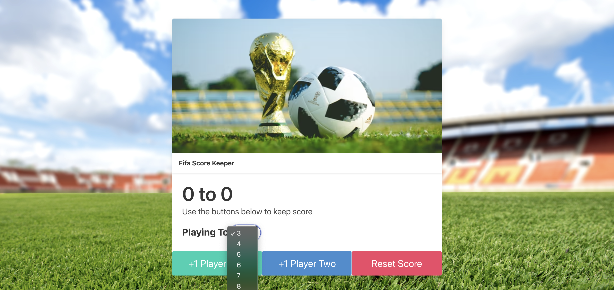
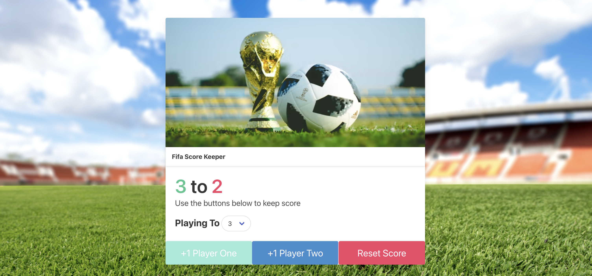

# Score Keeper Project

## A Score Keeper Application Utilizing HTML, CSS, JS and 3rd party Web APIs.  

This application is for keeping score in a two-player game. It was designed to keep score in FIFA games, but can be used for any 2 player game. The user can select the desired score to play to. Each player has a button that will increase their score until they reach the final selected score. When they reach the score, the winning score will become green, while the losing score will become red. They can reset the game to start the score over. 

The following is a link to the deployed application: https://charanvir.github.io/ScoreKeeper-Project/

Below are screenshots of the deployed application:
- 

- 

- 
